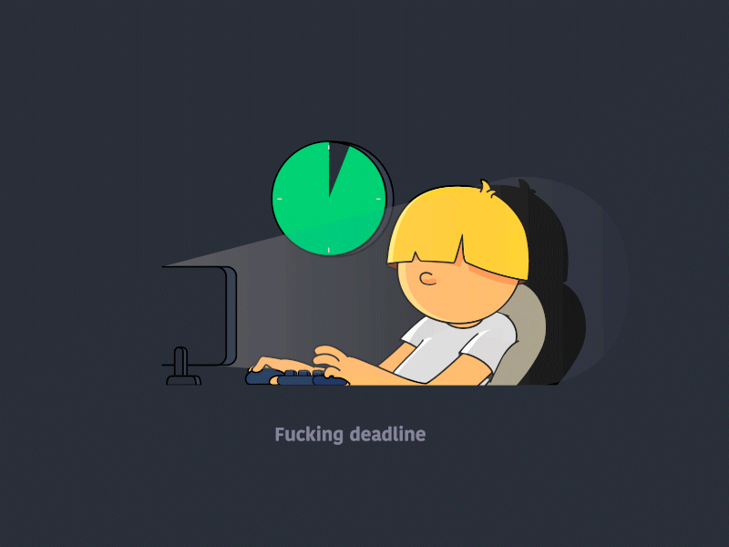

<div align="center">

# ⚡ V7KEYSTUDIO

### Developer • Designer • AI Enthusiast • Creative Technologist

<p>
  <b>Building digital experiences where code, design and intelligence meet.</b>
</p>

<a href="https://portfolio.v7keystudio.workers.dev">
  
</a>
<a href="https://github.com/v7keystudio">
  
</a>

</div>

---
<div align="center">



</div>

<br>

<div align="center">
  
## 👋 About Me

I'm **V7KEYSTUDIO**, a B.Sc. IT student and self-taught developer focused on building **modern web experiences, applications, creative interfaces and AI-powered projects**.

I enjoy working at the intersection of **development, design and emerging technology** — turning an idea from a concept into something people can actually use.

- 💻 Building modern **Web & Android applications**
- 🤖 Exploring **AI-powered products and intelligent interfaces**
- 🎨 Interested in **UI/UX, visual design and interactive experiences**
- 🐍 Working with **Python** and modern programming technologies
- 🌐 Exploring **Full-Stack Development**
- 🔐 Exploring **Cybersecurity & secure application development**
- ☁️ Working with modern **cloud & deployment platforms**
- 🧩 Building projects to learn by actually shipping
- 🤝 Open to **open-source collaboration, creative projects and interesting ideas**

> **My approach:** Learn → Build → Break → Improve → Ship.

---

## 🧠 What I Do

<table>
<tr>
<td width="50%">

### 💻 Development

- Web Applications
- Android Applications
- Frontend Development
- Backend & APIs
- Interactive UI
- Responsive Design
- Cloud Deployment

</td>
<td width="50%">

### 🎨 Design & Creative Tech

- UI/UX Design
- Visual Design
- Interactive Experiences
- Motion & Visual Effects
- Creative Web Design
- Product Interfaces
- AI-assisted Creative Workflows

</td>
</tr>
</table>

---

## 🛠️ Tech Stack

### 👨‍💻 Languages & Development


### ☁️ Cloud & Platforms


### 🎨 Design & Creative Tools


### 🧩 Frameworks & Tools


---

## 🚀 Featured Work

I build projects that combine **functionality, visual design and experimentation**.

### 🎵 Anirudh-Music

A cinematic interactive web experience dedicated to the musical journey, discography and career of Anirudh Ravichander.

**Focus:**  
`Interactive UI` • `Motion Design` • `JavaScript` • `GSAP` • `Responsive Design`

🔴 **Live:** https://v7keystudio.github.io/Anirudh-Music/

---

### 🥤 Chill with Sprite

An interactive product-card experiment built around CSS transitions, transforms, hover interactions and visual effects.

**Focus:**  
`HTML` • `CSS` • `Animations` • `UI Design` • `Interaction Design`

🔴 **Live:** https://v7keystudio.github.io/ChillwithSprite/

### 🧿 And Many More 🙂

---

## 🎯 Current Focus

```text
┌─────────────────────────────────────────────────────────┐
│                                                         │
│   FULL-STACK DEVELOPMENT       █████████░░              │
│   AI & INTELLIGENT APPS        ████████░░░              │
│   UI / UX & DESIGN             █████████░░              │
│   PYTHON DEVELOPMENT           ████████░░░              │
│   CLOUD & DEPLOYMENT           ███████░░░░              │
│   CYBERSECURITY                ██████░░░░░              │
│                                                         │
└─────────────────────────────────────────────────────────┘
